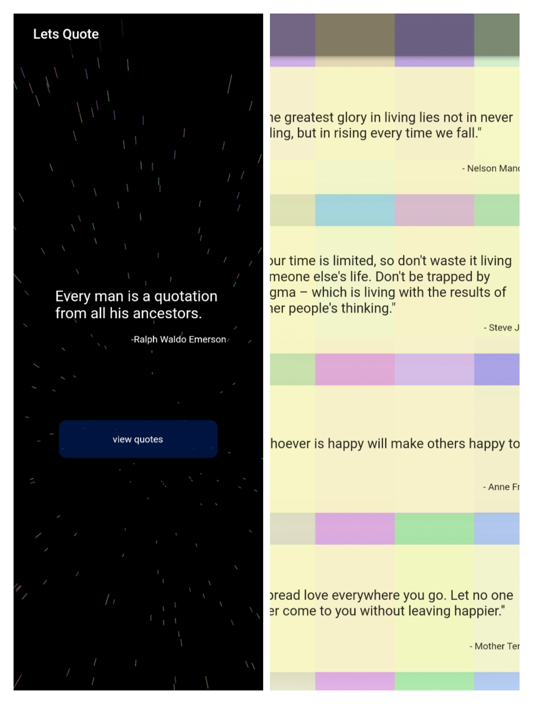

# Let's Quote
Flutter app for displaying quotes.
# Contributing

- Clone the repository
  ```sh
  git clone https://github.com/dscmbcet/Quotes-App
  ```
- Open the [quotes.json](./assets/quotes.json) file.
- Add in your quote inside the "items" key in the below format
  ```json
  {
    "author": "Napoleon Hill",
    "quote": "Whatever the mind of man can conceive and believe, it can achieve."
  }
  ```
- Commit changes and then open a pull request to this repository.


# Screenshots


</br>

# Contributors
[](https://github.com/dscmbcet/Quotes-App/graphs/contributors)

</br>

[](https://gdscmbcet.com)